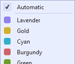
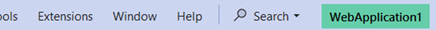
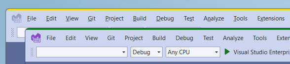
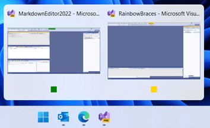

[marketplace]: https://marketplace.visualstudio.com/items?itemName=MadsKristensen.SolutionColors
[vsixgallery]: http://vsixgallery.com/extension/SolutionColors.dfa813d0-736b-491d-921a-4a3503d41543/
[repo]: https://github.com/madskristensen/SolutionColors

# Solution Colors for Visual Studio

Allows you to associate a color with a solution or folder and display it in various locations within Visual Studio. Inspired by the [Peacock extension](https://marketplace.visualstudio.com/items?itemName=johnpapa.vscode-peacock) for VS Code and [this Visual Studio feature request](https://developercommunity.visualstudio.com/t/Per-SolutionFolder-Color-Theme/608136?space=8&ftype=idea).

Download this extension from the [Visual Studio Marketplace][marketplace]
or get the [CI build][vsixgallery].

---

When you have multiple instances of Visual Studio open at the same time, it can be tricky to tell them apart. Especially if you’re working on different branches of the same solution, which makes them look almost identical. This extension solves this issue by colorizing each instance to make it easy to tell them apart.

The result is a subtle, yet very visible colorization that doesn’t feel noisy or distracting. It puts you in control with an array of customization options.

## Getting Started
To enable colorization, open a solution or folder and right-click it to select the Set Solution Color submenu. From here you can choose between a list of predefined colors matching the color palette used for colorizing document tabs. 

You are not limited to only choosing between the predefined colors. By selecting **Custom...** you can choose any custom color from the color dialog.

Visual Studio stores the color in the *.vs* folder next to the solution file or in the root of the workspace folder. That ensures that the same solution will always receive the same color.

After selecting a color manually, the **Enable Auto-Mode** button changes to **None**. That allows you to remove the color if you no longer want it.

## Auto-Mode

Instead of manually assigning a color to every solution, Visual Studio can do it automatically. With this option enabled, all solutions will be assigned a color when opened. The color is calculated based on the hash of the full path of the solution, so each solution will always be assigned the same color. 

When Auto-Mode is enabled, the button in the submenu changes to **Disable Auto-Mode**.

 

When Auto-Mode is active, you can still choose your own custom color for your solution. A manually selected color always takes precedence over Auto-Mode. 

## Colorized elements
The solution name in the title bar is visible at all times and located at the top, which makes it a prime location for colorization. 

In addition, the 3 top-most pixels of Visual Studio span the full width of the window. This is especially visible when Visual Studio instances are floating or if you’ve chosen not to display the solution name label.

The Windows Taskbar shows the colors in the thumbnails as well.

And if you don’t group the Taskbar items, each item will show the color as well.

This gives you 4 different locations to display the color and you can use all of them, or just the ones you find most helpful. You can control all that from the Tools -> Options page.

## How can I help?

If you enjoy using the extension, please give it a ★★★★★ rating on the [Visual Studio Marketplace][marketplace].

Should you encounter bugs or if you have feature requests, head on over to the [GitHub repo][repo] to open an issue if one doesn't already exist.

Pull requests are also very welcome, since I can't always get around to fixing all bugs myself. This is a personal passion project, so my time is limited.

Another way to help out is to [sponsor me on GitHub](https://github.com/sponsors/madskristensen).
