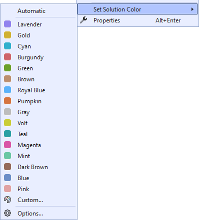
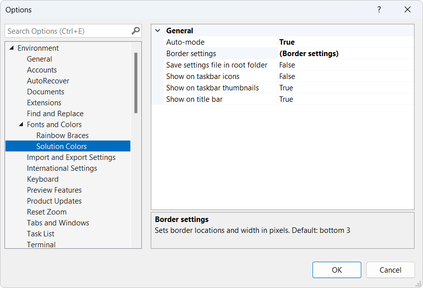

[marketplace]: https://marketplace.visualstudio.com/items?itemName=MadsKristensen.SolutionColors
[vsixgallery]: http://vsixgallery.com/extension/SolutionColors.dfa813d0-736b-491d-921a-4a3503d41543/
[repo]: https://github.com/madskristensen/SolutionColors

# Color Preview for Visual Studio

Download this extension from the [Visual Studio Marketplace][marketplace]
or get the [CI build][vsixgallery].

---

Allows you to associate a color with a solution or folder and display it in various locations within Visual Studio. Inspired by the [Peacock extension](https://marketplace.visualstudio.com/items?itemName=johnpapa.vscode-peacock) for VS Code and [this Visual Studio feature request](https://developercommunity.visualstudio.com/t/Per-SolutionFolder-Color-Theme/608136?space=8&ftype=idea).

## Color locations
There are three locations where you can chose to display the color.

* [Border](#border)
* [Solution label](#label)
* [Windows Taskbar](#taskbar)

### Border
Puts a border on either the bottom, left, right, or top sides of the main document window.

### Solution label
Colorize the solution name in the title bar at the top of Visual Studio. 

### Windows Taskbar
The colors are also added to the Windows Taskbar to make it easy to tell the instances apart.

## Chose a color
You can pick a color from the context menu of the solution node in Solution Explorer:

## Custom colors
You are not limited by the predefined colors. By selecting **Custom...** you can choose any custom color from the color dialog.

## Auto-Mode
Instead of manually assigning a color to every solution, the extension can do it automatically. With this option enabled, all solutions will be assigned a color when opened. The color is calculated based on the hash of the full path of the solution, so each solution will always have the same color.

## Settings
Set the width of the line in the options dialog and determine the locaion

## How can I help?

If you enjoy using the extension, please give it a ★★★★★ rating on the [Visual Studio Marketplace][marketplace].

Should you encounter bugs or if you have feature requests, head on over to the [GitHub repo][repo] to open an issue if one doesn't already exist.

Pull requests are also very welcome, since I can't always get around to fixing all bugs myself. This is a personal passion project, so my time is limited.

Another way to help out is to [sponsor me on GitHub](https://github.com/sponsors/madskristensen).
